# Ice Attack VFX
An ice attack vfx, 3D models for spikes and snow.
Using VFX Graph and Shader Graph in Unity **Unity 2021.3.10f1**

## Features

- [Ground Textures](#ground-textures)
- [Spikes Mesh](#spikes-mesh)
- [Snow Mesh](#snow-mesh)

## Screenshots

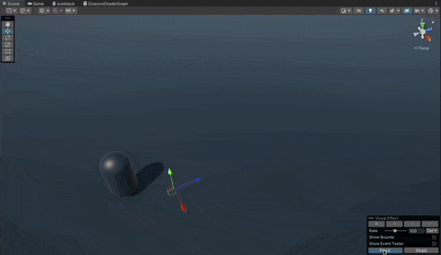

---
## Ground Textures

[Ice Attack VFX by Gabriel Aguiar](https://www.youtube.com/watch?v=gfOaGvNQ28U)

### Sub VFX Graph

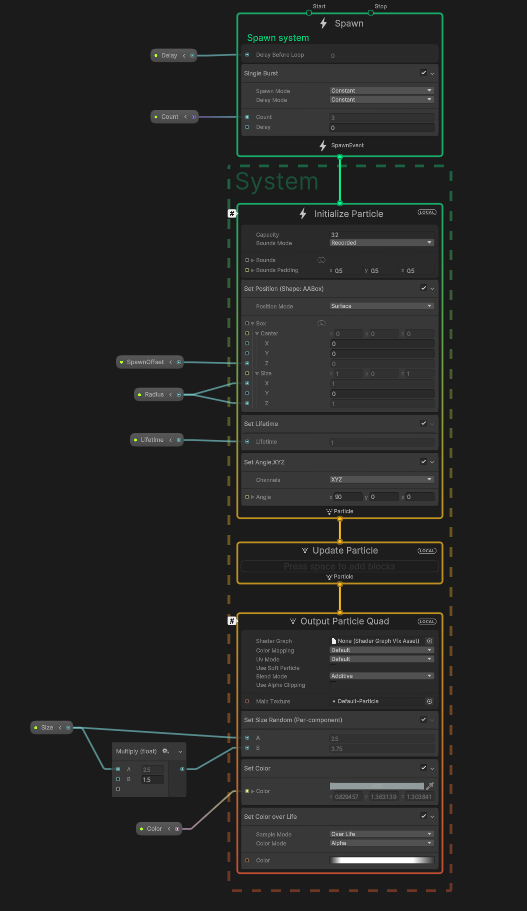

---
## Spike Mesh

### Blender 3D Modeling

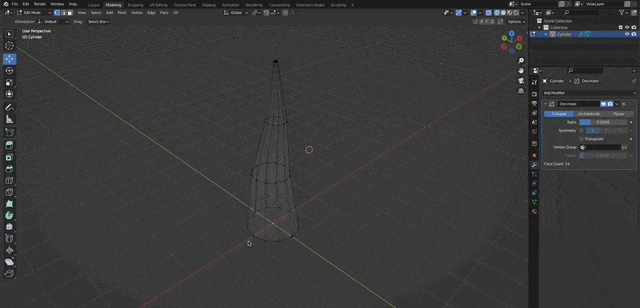

### Dissolve/Fresnel Shader

[Burning Paper Effect by Gabriel Aguiar](https://www.youtube.com/watch?v=fgJf-gNq-1k)

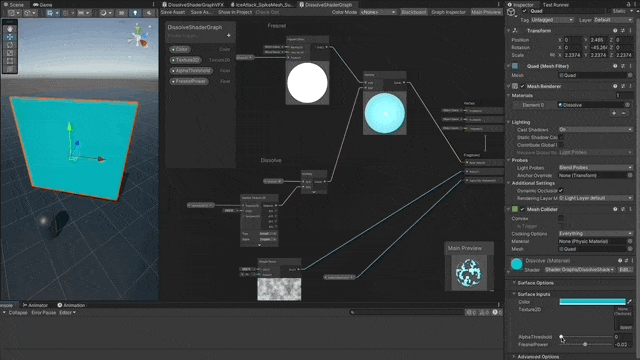
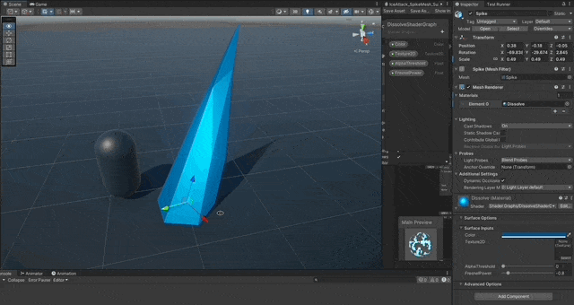

### Shader Graph

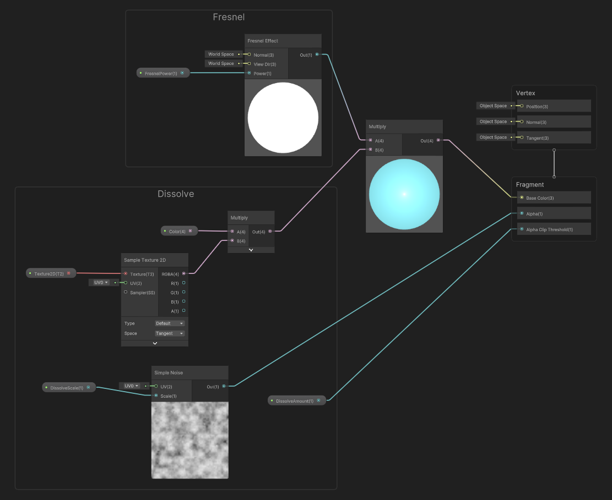

### Spike VFX

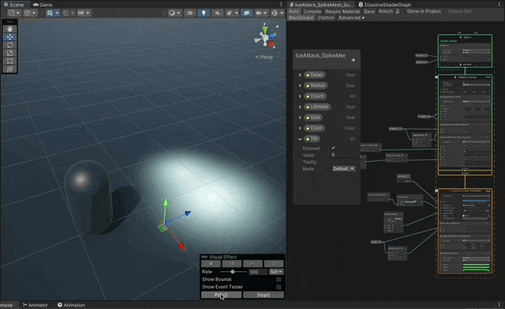

### Sub VFX Graph

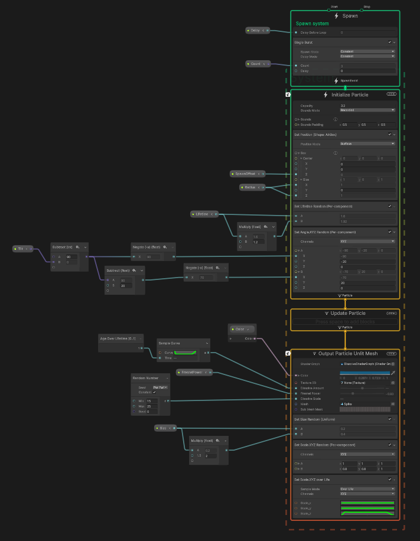

---

## Snow Mesh

### Blender 3D Modeling

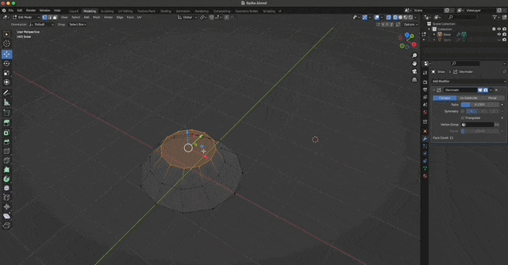

### Snow + Spike VFX

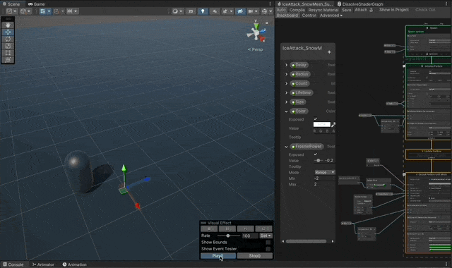

### Sub VFX Graph

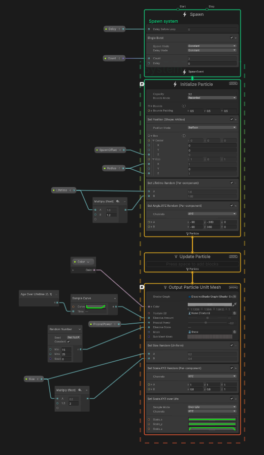

---

## 3 Waves

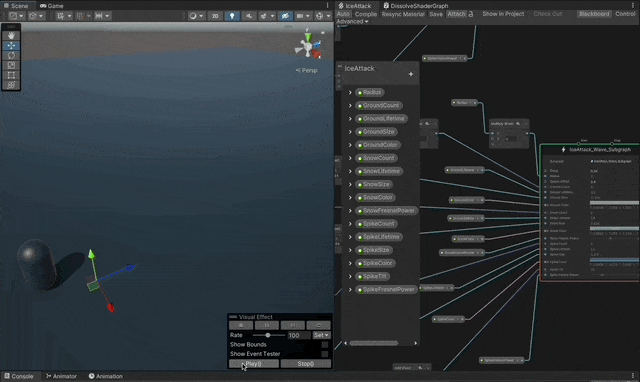

### Sub VFX Graph

### Main VFX Graph

---

## Implementation explained

1. **Project configuration**

   1. Use the Universal Render Pipeline.
   1. Use VFX Graph.
   1. Use Shader Graph.

1. **Ground Textures**

    1. **Spawn Rate**
        1. We don't want a constant spawn rate, we need a burst.
        1. In the **Spawn** node of the VFX.
            1. Add a single burst component.
            1. Parametrize the amount of particles it will spawn.
            1. Parametrize the delay, this will be used later for the 2nd and 3rd burst.

    1. **Spawn Velocity and Position**
        1. We don't need velocity for the particles, they should stay stationed.
        1. In the **Initialize Particle** node of the VFX.
            1. Remove the velocity settings.
            1. Use a box shape for spawn position, with height 0, making it a plane.
            1. Parametrize the radius of the spawn shape
            1. Parametrize a lifetime of 3 seconds for particles.

    1. **Rendering**
        1. In the **Output Particle Quad** node of the VFX.
            1. Use a default texture for easier implementation.
            1. Remove the face camera plane component.
            1. **Size**
                1. Remove size over life, but replace with a constant set size.
                1. Parametrize the size, each subsequent burst should be bigger.
            1. **Color**
                1. Parametrize a color to be able to configure the VFX, using the set color component.
                1. Keep color over life to be able to fade it out.
                1. Make color over life to have Alpha mode, so that it only affects the Alpha of the parametrized color.
        1. In the **Initialize Particle** node of the VFX.
            1. Rotate the particles 90 degrees to make them parallel to the ground.

    1. Make the Ground Textures System a Sub Graph.

1. **Spike Mesh**

    1. **Create the 3D Mesh in Blender**
        1. Start from a cylinder and shape it into a cone.
        1. Add more geometry to skew it like a spike.
        1. Use the decimate modifier to make it look low poly.
        1. Export the mesh into unity.

    1. **Rendering**
        1. Copy paste the group we did for the ground textures.
        1. Delete the Quad Output node and replace it with a Mesh Output node.

        1. In the **Output Particle Mesh** node of the VFX.
            1. Assign the spike mesh.

    1. **Initializing the Particles**
        1. In the **Initialize Particle** node of the VFX.
            1. Set the pivot of the meshes to make them grounded.
            1. Set a random initial angle to make them face forward.
            1. Set a small randomness to the life time.

    1. **Dissolve Shader**
        1. Create a **Shader Graph**
        1. The _Visual Effect_ as an active target is deprecated as of this Unity version. Just make sure the universal target of the shader graph has the option "Support VFX Graph" checked.
        1. Enable _Alpha Clipping_.
        1. Set surface type to Opaque.
        1. Using a random noise to make the material dissolve.
        1. Parametrize the color and alpha threshold.
        1. Add an fresnel effect and parametrize it too.

        1. In the **Output Particle Mesh** node of the VFX.
            > NOTE: The integration between VFX Graph and Shader Graph [is still experimental](https://forum.unity.com/threads/vfx-particle-mesh-material.975813/), so, you need to [enable experimental features for Visual Effects](https://learn.unity.com/tutorial/integrate-shader-graph-into-visual-effect-graph) to be able to use this.
            > Also, VFX Graph works using compute shaders, that means this will only work in URP compatible [devices that are also compute capable](https://forum.unity.com/threads/compute-shader-support-for-mobile-in-2022.1305024/).
            1. Assign the **Dissolve Shader** Asset.
            1. Make the dissolve evolve over time using a custom curve.

    1. **Size and Scale**
        1. In the **Output Particle Mesh** node of the VFX.
            1. Set a random size to make the spikes have different sizes.
            1. Make them scale over time along Z, to create the effect of them growing off the ground.

    1. Make the Spikes System a Sub Graph.

1. **Snow Mesh**

    1. **Create the 3D Mesh in Blender**
        1. Start from a cylinder and shape it into a truncated cone.
        1. Add more geometry to skew it like a small hill with a plateau.
        1. Use the decimate modifier to make it look low poly.
        1. Export the mesh into unity.

    1. **Rendering**
        1. Copy paste the group we did for the spikes mesh.
        1. Delete the Quad Output node and replace it with a Mesh Output node.

        1. In the **Output Particle Mesh** node of the VFX.
            1. Assign the snow mesh.
            1. Create new parameters for the colors for the snow.
            1. Change the colors so that it looks more like snow.

        1. In the **Initialize Particle** node of the VFX.
            1. Change the positions so that the snow is in the ground.

    1. Make the Snow System a Sub Graph.

1. **2nd and 3rd Waves**
    1. Make a new Sub Graph out of the whole that is using the 3 Sub Graphs. This will allow you to reuse it 3 times to make the 3 waves.
    1. Parametrize the Delay and set it to _Before Loop_
    1. Parametrize the position of the random box area for the spawning, each wave will need to spawn further ahead.
    1. Parametrize all configurations related to particle count, spawn angle, particle size, etc, to make each subsequent wave bigger and different.
